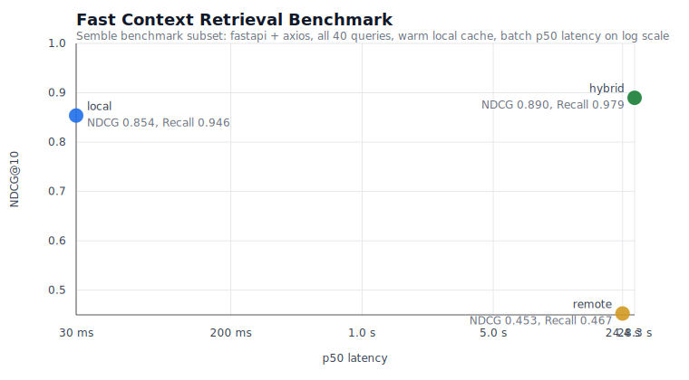

# Fast Context 技能

[English](README.md)

给 Codex、Claude 这类 coding agent 用的仓库搜索工具，尽量做轻。

以前它是个 Node/MCP 打包的东西，现在简化成纯 Python CLI + skill 工作流。后端连的还是 Windsurf 逆向出来的 SWE-grep，本地这边尽量不折腾：

- 本地 Semble 先捞缓存的 chunk 候选
- 从 `state.vscdb` 把 Windsurf 凭据提出来
- 发给远端做语义搜索之前，先补上本地 lexical anchors
- repo map 太大时自动压缩，别让 payload 撑爆
- 输出更适合 skill 接的候选文件、行号范围和后续 grep 关键词

## 为什么这么设计

代码搜索要效果好，靠的是混合链路，几个环节串起来：

1. 本地先用 Semble 跑一圈，拿到热缓存的 chunk 候选。
2. 同时把仓库里精确的词法线索也留着：文件名、路径、字面量关键词。
3. 把 Semble 候选、词法线索、紧凑的 repo map 一起丢给远端做语义搜索。
4. Windsurf 用 `rg`、`readfile`、`tree`、`ls`、`glob` 验证并扩展相关文件。
5. 远端走不通就降级到本地 Semble chunk 检索，至少不空手。
6. 最后只给一小组真正值得读的文件或 chunk。

本地侧用 Python 写，纯粹为了直接当 skill 跑。Semble 管本地索引和热缓存 chunk 检索；Windsurf 仍然负责 agent 那层的验证和扩展。

## 混合搜索流程

```text
用户查询
  -> 本地 Semble 预取
     -> 缓存索引 + potion-code-16M chunks
  -> fast-context prompt
     -> 原始查询 + Semble chunk 提示 + lexical anchors + repo map
  -> Windsurf 远端搜索
     -> 用 rg/readfile/tree/ls/glob 验证提示并扩展相关文件
  -> Start here 输出
     -> 文件、行号范围、后续搜索词、本地 chunk 候选

远端走不通时的降级路径：
  Windsurf auth/rate-limit/timeout/resource_exhausted
    -> 返回本地 Semble 结果，至少不空手
```

## 文件结构

```text
fast-context/
├── benchmarks/
│   ├── data.py               # Semble benchmark 子集加载和固定 revision 校验
│   ├── metrics.py            # 文件级检索指标和 bootstrap 置信区间
│   └── run_retrieval_benchmark.py   # 控速后的 local/remote/hybrid benchmark runner
├── assets/
│   └── images/
│       └── retrieval_benchmark_speed_vs_quality.svg
├── src/
│   ├── core.py               # 协议、搜索循环、repo map、本地 lexical anchors
│   ├── extract_key.py        # 从 state.vscdb 提取 Windsurf 凭据
│   ├── local_semble.py       # 本地 Semble 适配层
│   └── fast_context_cli.py   # CLI 入口
├── SKILL.md                  # Skill 说明
├── pyproject.toml
└── uv.lock
```

## 环境要求

- Python 3.10 到 3.13（`>=3.10,<3.14`）
- `uv`
- 同一台机器上已登录 Windsurf，或者手动设了 `WINDSURF_API_KEY`
- 需要 Semble 做本地 chunk 搜索；`uv sync` 会把它当普通依赖一起装好
- 有 `rg` 更方便；没有的话仓库里也内置了 Python 版的兜底搜索

## 安装

装依赖：

```bash
uv sync
```

通过 `uv` 运行 CLI：

```bash
uv run fast-context --help
```

依赖或 Python 版本变化后，刷新 lockfile：

```bash
uv lock --default-index https://pypi.org/simple
```

## 给 code agent 的 prompt 片段

当 code agent 在改代码、review 或调试前需要快速完成仓库定位时，可以直接用下面这段：

```text
Use the installed `fast-context` skill for intent-based or open-ended codebase search when the exact path or symbol is not known yet.

Run:
python "$HOME/.agents/skills/fast-context/src/fast_context_cli.py" search \
  --query "<natural language query>" \
  --project "<repo-root>"

Notes:
- Prefer `fast-context` before `rg` for vague questions: debugging explorations, "where is X?", flow tracing, or feature-oriented repo navigation.
- If the exact filename, path, or symbol is already known, use `rg` or open the file directly instead of starting with `fast-context`.
- Treat `fast-context` as a candidate-file generator, not a proof source. After it returns results, read the relevant files and use exact search only to confirm names, events, tests, or call sites.
- Split unrelated questions into separate `fast-context` queries. Long natural-language queries are fine when they describe one workflow, but multi-topic queries can drop weaker subtopics.
- Do not treat "results found" as evidence that a feature exists. For negative or fictional queries, `fast-context` may still return approximate matches; verify existence from the code before concluding.
- Prefer queries that describe behavior and data flow, not just nouns: include user action, runtime boundary, expected effect, and any known payload fields.
- If remote Windsurf search fails, use the returned local Semble results to keep moving.
```

## CLI

### 搜索

```bash
uv run fast-context search \
  --query "where is the desktop browser login handoff state validated" \
  --project .
```

常用参数：

- `--backend hybrid|remote|local`（默认是 `hybrid`）
- `--tree-depth <1-6>`
- `--max-turns <1-5>`
- `--max-results <1-30>`
- `--timeout-ms <ms>`
- `--verbose`
- `--exclude <path-or-glob>`，可重复传入
- `--content code|docs|config|all`，用于 Semble 预取和 local-only 搜索

输出示例：

```text
Start here:

1. /repo/apps/desktop/src/auth/session.ts
   - L18-102: applyExternalSession() - matches: handoff, state

2. /repo/apps/desktop/src/auth/handoff.ts
   - L5-88: createAuthHandoff() - matches: handoff, desktop-launch

3. /repo/apps/desktop/test/ipc-auth-boundary.integration.test.ts
   - L40-141: rejects external-session callbacks without state - matches: state

Follow-up search terms:
applyExternalSession, createAuthHandoff, handoff.*state
```

`--backend hybrid` 先跑 Semble，把本地 top chunks 塞进 Windsurf 的搜索 prompt，然后让 Windsurf 用受限的 repo 工具验证和扩展。如果远端走不通——比如鉴权失败、超时、上游 `resource_exhausted`——CLI 还是会返回本地 Semble 结果，agent 至少能继续往下走。

### 本地 Semble 搜索

直接运行缓存后的本地 chunk 检索：

```bash
uv run fast-context local-search \
  --query "how semantic and lexical scores are fused" \
  --project .
```

搜索文档或配置：

```bash
uv run fast-context local-search \
  --query "deployment guide" \
  --project . \
  --content docs
```

基于已有结果找相关 chunks：

```bash
uv run fast-context find-related \
  --file src/search.py \
  --line 77 \
  --project .
```

### Semble 缓存管理

清理单个项目的缓存：

```bash
uv run fast-context cache-clear --project .
```

回收已经失效的 Semble 缓存目录（例如原始 `root_path` 已不存在）：

```bash
uv run fast-context cache-gc
```

只预览、不删除：

```bash
uv run fast-context cache-gc --dry-run
```

### 提取 Windsurf/Devin 凭据

本机直接提取：

```bash
uv run fast-context extract-key
```

从复制出来的数据库文件或 Devin CLI credentials 提取：

```bash
uv run fast-context extract-key --db-path /tmp/state.vscdb
uv run fast-context extract-key --db-path ~/.local/share/devin/credentials.toml
```

自动发现会先检查 Linux/WSL 下的 Devin CLI credentials，然后再找 `Deviv`、`Devin`、`Windsurf` 本地 app 数据库。当前安装里，凭据可能是传统 API key，也可能是 `devin-session-token$...` 这种 session 风格 token。只要 Windsurf/Devin 自己接受，这个仓库也会直接接受。

## 环境变量

- `WINDSURF_API_KEY`：显式覆盖凭据
- `WS_MODEL`：可选模型覆盖，默认 `MODEL_SWE_1_6_FAST`
- `WS_FALLBACK_MODELS`：可选的逗号分隔 fallback 链，默认 `MODEL_SWE_1_5`
- `WS_APP_VER`
- `WS_LS_VER`

## 模型选择

基于 `2026-05-31` 在本地跑过的测试，当前比较顺手的默认值是：

- `MODEL_SWE_1_6_FAST` —— 日常 coding 用和一次性仓库定位，最稳。
- 主模型遇上 `resource_exhausted` 或限流时，会自动 fallback 到 `MODEL_SWE_1_5`。
- 想自己调 fallback 顺序的话，设 `WS_FALLBACK_MODELS` 就行，比如 `WS_FALLBACK_MODELS=MODEL_SWE_1_5,MODEL_SWE_1_6`。
- `MODEL_SWE_1_7_FAST` 暂时不推荐。

这些结论是经验性的，不保证永远对。上游容量一变，延迟和成功率也会跟着变。

## 检索基准测试

原来只有 12 条 smoke queries，现在换成了一套完整的 40 条 benchmark，基于本机已同步的两个 Semble benchmark 仓库：

- `fastapi`，revision `c3c9dd6b1a08`（`benchmark_root=fastapi`）
- `axios`，revision `c7a76ddbf277`（`benchmark_root=lib`）
- 一共 40 条带标签的查询：12 条 `architecture`、17 条 `semantic`、11 条 `symbol`

benchmark runner 在 [`benchmarks/run_retrieval_benchmark.py`](benchmarks/run_retrieval_benchmark.py)。默认行为尽量贴近 Semble 的约定，同时适配本仓库：

- 拿 Semble 的 annotation JSON 当 ground truth
- 跑 benchmark 之前强制校验 repo revision
- 所有 backend 对齐到同一份文件级 relevance targets
  （这里故意按文件级打分：`remote` 返回 file/range，`local` 返回 chunks）
- 每个 repo 先热一遍本地 Semble 缓存，再测 query latency
- `remote` 和 `hybrid` 按 completion-based cooldown 串行跑
  - 当前比较公平的默认值：`remote_cooldown_ms=10000`、`remote_jitter_ms=2000`、`retry_base_ms=15000`、`retry_max_ms=60000`、`max_retries=4`
  - cooldown 从"上一次请求完成后"开始计时，不只是限制请求间隔
- 按 query 交替 `remote` / `hybrid` 的执行顺序，减小顺序偏差
- 从逐 query 指标算 95% bootstrap confidence intervals

复现 benchmark 并重新生成图表：

```bash
uv run python -m benchmarks.run_retrieval_benchmark \
  --clear-local-cache \
  --remote-cooldown-ms 10000 \
  --remote-jitter-ms 2000 \
  --retry-base-ms 15000 \
  --retry-max-ms 60000 \
  --max-retries 4 \
  --output benchmarks/results/retrieval-fastapi-axios-2026-06-01.json \
  --plot assets/images/retrieval_benchmark_speed_vs_quality.svg
```

benchmark 脚本默认会去找兄弟目录下的 `../semble/benchmarks` checkout。必要时可以用 `SEMBLE_BENCHMARK_ROOT=/path/to/semble/benchmarks` 覆盖。

本次运行产物：

- JSON 汇总和逐 query trace：[`benchmarks/results/retrieval-fastapi-axios-2026-06-01.json`](benchmarks/results/retrieval-fastapi-axios-2026-06-01.json)
- 速度/质量图：[`assets/images/retrieval_benchmark_speed_vs_quality.svg`](assets/images/retrieval_benchmark_speed_vs_quality.svg)



### 关于公平性的说明

下面这些 `2026-06-01` 的数字，是在 runner 切换成 completion-based cooldown 之前跑出来的。旧 runner 只卡请求启动间隔，意味着差不多 `~5s` 的 remote 调用跑完后，几乎立刻就会发出下一次请求——长批次下来很容易把 Windsurf 压炸。所以已经发出去的 `remote` / `hybrid` 数据更像一次压力测试，离公平的 backend 一对一对比还有距离。

现在 runner 的默认值故意放慢了速度，也更公平。以后任何对外发的 benchmark 更新，都应该用这套默认值重新跑。

### 质量汇总

| Backend | NDCG@10 | 95% CI | Recall@10 | 95% CI | Top-1 | MRR |
|---|---:|---:|---:|---:|---:|---:|
| `local` | 0.854 | 0.774-0.926 | 0.946 | 0.875-1.000 | 0.775 | 0.850 |
| `remote` | 0.453 | 0.309-0.604 | 0.467 | 0.312-0.617 | 0.450 | 0.475 |
| `hybrid` | 0.890 | 0.835-0.939 | 0.979 | 0.946-1.000 | 0.825 | 0.896 |

### 运行汇总

| Backend | Batch p50 latency | Batch p90 latency | Final non-empty output | Remote success | `resource_exhausted` / degraded | Total retries |
|---|---:|---:|---:|---:|---:|---:|
| `local` | 30 ms | 39 ms | 100% | n/a | 0 | 0 |
| `remote` | 24.4 s | 37.5 s | 50% | 52.5% | 19 | 43 |
| `hybrid` | 28.3 s | 40.0 s | 100% | 50.0% | 20 degraded | 44 |

本地热缓存建索引成本（在 query timing 之前单独测量）：

- `fastapi`: 422 ms
- `axios`: 65 ms

### 分类别结果

按查询类别统计的 NDCG@10：

| Category | `local` | `remote` | `hybrid` |
|---|---:|---:|---:|
| `architecture` | 0.718 | 0.506 | 0.819 |
| `semantic` | 0.855 | 0.473 | 0.869 |
| `symbol` | 1.000 | 0.364 | 1.000 |

### 如何解读

- `local` 是吞吐基线：热缓存 p50 只有 `30 ms`，质量已经很强（`0.854` NDCG@10 / `0.946` recall@10），整轮 benchmark 也没有失败。
- `local` 仍然是 bulk eval、CI 和低延迟 repo 搜索里最稳妥的基线选择。
- 旧版 `remote` / `hybrid` 行暴露出来的更多是 runner bug；它不能代表 backend 质量真相：只限制启动间隔不足以避免长批次里上游限流。
- 现在的公平 runner 已经改成 completion-based cooldown，并加入了有上限的 retry 窗口。因此，下一轮对外发布的 `remote` / `hybrid` 数字应该用当前默认值重新生成，不建议直接拿旧 stress run 表格做横向对比。
- 在日常交互里，`hybrid` 仍然是合适的默认模式：本地 Semble 先给提示，Windsurf 再做验证。只是不要把旧版退化 batch 结果当成它的稳定质量上限。

## Skill 使用方式

建议走 `SKILL.md` 来用，不过直接跑 CLI 也适合本地调试和快速翻仓库。

典型流程：

1. 拿自然语言查询跑 Fast Context。默认 `--backend hybrid` 先预取本地 Semble chunks，再让 Windsurf 验证和扩展。
2. 打开返回的文件接着读。
3. 如果是批量跑、CI 或者要低延迟搜仓库，用 `--backend local`，完全不依赖 Windsurf。
4. 只有你想单独看 Windsurf 的行为、不想带本地 chunk 提示的时候，才切 `--backend remote`。
5. 碰到有价值的本地 chunk，用 `find-related` 继续找类似代码。
6. 最后再用 `rg` 或 `ast-grep` 确认精确的调用点和符号。

## 备注

- 本地 lexical anchors 是通用启发式规则，偏向精确的文件名、路径片段和查询中的字面量命中。
- repo tree 太大的时候，repo map 会自动缩。
- 远端请求超时或者 payload 太大时，搜索循环会裁掉旧上下文再重试一次。
- Fast Context 直接调 Semble Python library，新建的本地索引会存回 Semble 缓存，Semble 自己会在索引文件变化时自动判断要不要失效。
- Semble chunk 命中只是候选，不能当最终证据。Hybrid 模式会先让 Windsurf 验证，再生成主 `Start here` 输出。
- 默认输出尽量简洁；需要 anchor snippets 或 config diagnostics 时加 `--verbose`。

## License

MIT
