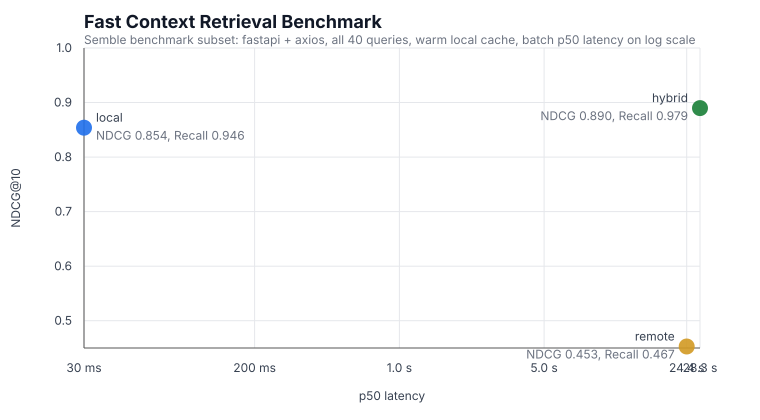

# Fast Context 技能

[English](README.md)

Fast Context 是一款面向 Coding Agent（如 Codex、Claude 等）的代码上下文定位工具。

项目使用轻量纯 Python CLI 替代原有的 Node/MCP 封装，通过**本地 Semble 向量/分块预取**与**远端 Windsurf（SWE-grep）符号推理**的混合检索架构，帮助 Agent 在大中型代码库中快速锁定相关文件与行号。

- **快速本地预取**：利用 Semble 本地缓存秒级检索相关的代码分块（Chunks）。
- **远端符号推理**：结合本地词法线索（Lexical Anchors）与热点目录树，调用 Windsurf 智能验证并展开调用链。
- **平滑降级兜底**：远端遇限流、超时或无凭据时，自动回退到本地 Semble 结果，确保 Agent 不中断。
- **智能上下文控制**：采用 BM25F 目录热度与自适应 Top-K 生成 Hotspot Repo Map，显著降低 Prompt 消耗并提升文件召回率。
- **即开即用**：自动从本机提取 Windsurf / Devin 凭据，输出精简规范的文件及行号范围。

## 架构设计

在不熟悉的大型仓库中，单纯依赖全文正则（如 `rg`）往往缺乏全局语义，而直接让大模型遍历全仓又受限于 Token 成本和速率限制。Fast Context 采用两级混合检索：

1. **本地语义预检**：Semble 检索热缓存中的高相关性代码分块。
2. **提取词法线索**：提取查询相关的精确文件名、路径片段与关键字（Lexical Anchors）。
3. **构造热点地图**：基于 BM25F 计算相关目录热度，生成轻量级的 Hotspot Repo Map。
4. **远端验证扩展**：将上述线索注入 Windsurf，由远端引擎执行定向符号验证与调用链展开。
5. **故障降级**：远端接口不可用时，直接返回本地 Semble 分块，保证流程不中断。
6. **聚焦输出**：最终仅返回 3-10 个高度可信的候选文件、代码行区间及后续检索建议。

## 检索流程

```text
用户查询
  │
  ├── 1. 本地 Semble 预取 ──────> 命中缓存代码分块 (Chunks)
  │
  ├── 2. 本地词法分析 ──────────> 提取文件名、路径线索与 Hotspot Repo Map
  │
  └── 3. 混合组装与远端验证 ────> Windsurf 展开调用链并校验
            │
            ├─ (正常) ──> 返回 Start Here 候选文件清单与行号
            └─ (异常) ──> 自动降级返回本地 Semble 分块
```

## Hotspot Repo Map

在复杂代码库中，直接提供完整深层目录树不仅冗长而且包含大量噪音。Fast Context 在向远端发起检索前，会动态生成一份与当前查询紧密相关的热点地图：

- **Repository Map**：顶层紧凑目录树，保留全局结构轮廓。
- **Relevant File Paths**：本地词法命中的高相关路径，在 Token 预算紧张时优先保留。
- **Hotspot Subtrees**：基于 BM25F 评分排序的热点目录，自适应展开更可能包含目标逻辑的子树。

在 16 组大型私有仓库查询的 A/B 对照测试中，热点地图相比传统紧凑树（Classic Tree）大幅提升了精确文件的早期曝光率：

| 方案 | 文件召回率 (File recall) | 深层目录覆盖率 | 文件 MRR | 构建耗时 (p50) | 平均体积 |
|---|---:|---:|---:|---:|---:|
| `classic` (传统紧凑树) | 0.0000 | 1.0000 | 0.0000 | 10 ms | 2.4 KB |
| `hotspot` (热点地图) | 0.4792 | 1.0000 | 0.0184 | 120 ms | 11.9 KB |

*数据说明：虽然热点地图微幅增加了本地预处理耗时（约 100ms）和 Prompt 占用，但它能让远端推理阶段在介入之前就看到精确候选文件，显著提升检索收敛速度。*

## 文件结构

```text
fast-context/
├── benchmarks/
│   ├── data.py               # Semble benchmark 子集加载和固定 revision 校验
│   ├── metrics.py            # 文件级检索指标和 bootstrap 置信区间
│   └── run_retrieval_benchmark.py   # 控速后的 local/remote/hybrid benchmark runner
├── assets/
│   └── images/
│       └── retrieval_benchmark_speed_vs_quality.svg
├── src/
│   ├── core.py               # 协议、搜索循环、repo map、本地 lexical anchors
│   ├── extract_key.py        # 从 state.vscdb 提取 Windsurf 凭据
│   ├── local_repo_map.py     # BM25F 目录热度、adaptive topK、path spines
│   ├── local_semble.py       # 本地 Semble 适配层
│   └── fast_context_cli.py   # CLI 入口
├── SKILL.md                  # Skill 说明
├── pyproject.toml
└── uv.lock
```

## 环境要求

- Python 3.10 到 3.13（`>=3.10,<3.14`）
- `uv`
- 同一台机器上已登录 Windsurf，或者手动设了 `WINDSURF_API_KEY`
- 需要 Semble 做本地 chunk 搜索；`uv sync` 会把它当普通依赖一起装好
- 有 `rg` 更方便；没有的话仓库里也内置了 Python 版的兜底搜索

## 安装

装依赖：

```bash
uv sync
```

通过 `uv` 运行 CLI：

```bash
uv run fast-context --help
```

依赖或 Python 版本变化后，刷新 lockfile：

```bash
uv lock --default-index https://pypi.org/simple
```

## 给 code agent 的 prompt 片段

当 code agent 在改代码、review 或调试前需要快速完成仓库定位时，可以直接用下面这段：

```text
Use the installed `fast-context` skill for intent-based or open-ended codebase search when the exact path or symbol is not known yet.

Run:
python "$HOME/.agents/skills/fast-context/src/fast_context_cli.py" search \
  --query "<natural language query>" \
  --project "<repo-root>"

Notes:
- Prefer `fast-context` before `rg` for vague questions: debugging explorations, "where is X?", flow tracing, or feature-oriented repo navigation.
- If the exact filename, path, or symbol is already known, use `rg` or open the file directly instead of starting with `fast-context`.
- Treat `fast-context` as a candidate-file generator, not a proof source. After it returns results, read the relevant files and use exact search only to confirm names, events, tests, or call sites.
- Split unrelated questions into separate `fast-context` queries. Long natural-language queries are fine when they describe one workflow, but multi-topic queries can drop weaker subtopics.
- Do not treat "results found" as evidence that a feature exists. For negative or fictional queries, `fast-context` may still return approximate matches; verify existence from the code before concluding.
- Prefer queries that describe behavior and data flow, not just nouns: include user action, runtime boundary, expected effect, and any known payload fields.
- If remote Windsurf search fails, use the returned local Semble results to keep moving.
```

## CLI

### 搜索

```bash
uv run fast-context search \
  --query "where is the desktop browser login handoff state validated" \
  --project .
```

常用参数：

- `--backend hybrid|remote|local`（默认是 `hybrid`）
- `--tree-depth <1-6>`
- `--max-turns <1-5>`
- `--max-results <1-30>`
- `--timeout-ms <ms>`
- `--verbose`
- `--exclude <path-or-glob>`，可重复传入
- `--content code|docs|config|all`，用于 Semble 预取和 local-only 搜索

输出示例：

```text
Start here:

1. /repo/apps/desktop/src/auth/session.ts
   - L18-102: applyExternalSession() - matches: handoff, state

2. /repo/apps/desktop/src/auth/handoff.ts
   - L5-88: createAuthHandoff() - matches: handoff, desktop-launch

3. /repo/apps/desktop/test/ipc-auth-boundary.integration.test.ts
   - L40-141: rejects external-session callbacks without state - matches: state

Follow-up search terms:
applyExternalSession, createAuthHandoff, handoff.*state
```

`--backend hybrid` 先跑 Semble，把本地 top chunks 塞进 Windsurf 的搜索 prompt，然后让 Windsurf 用受限的 repo 工具验证和扩展。如果远端走不通——比如鉴权失败、超时、上游 `resource_exhausted`——CLI 还是会返回本地 Semble 结果，agent 至少能继续往下走。

### 本地 Semble 搜索

直接运行缓存后的本地 chunk 检索：

```bash
uv run fast-context local-search \
  --query "how semantic and lexical scores are fused" \
  --project .
```

搜索文档或配置：

```bash
uv run fast-context local-search \
  --query "deployment guide" \
  --project . \
  --content docs
```

基于已有结果找相关 chunks：

```bash
uv run fast-context find-related \
  --file src/search.py \
  --line 77 \
  --project .
```

### Semble 缓存管理

清理单个项目的缓存：

```bash
uv run fast-context cache-clear --project .
```

回收已经失效的 Semble 缓存目录（例如原始 `root_path` 已不存在）：

```bash
uv run fast-context cache-gc
```

只预览、不删除：

```bash
uv run fast-context cache-gc --dry-run
```

### 提取 Windsurf/Devin 凭据

本机直接提取：

```bash
uv run fast-context extract-key
```

从复制出来的数据库文件或 Devin CLI credentials 提取：

```bash
uv run fast-context extract-key --db-path /tmp/state.vscdb
uv run fast-context extract-key --db-path ~/.local/share/devin/credentials.toml
```

自动发现会先检查 Linux/WSL 下的 Devin CLI credentials，然后再找 `Deviv`、`Devin`、`Windsurf` 本地 app 数据库（规范大小写与小写两种目录名都会探测，因为安装器并不统一，例如 Windows 上的 Devin 会写成 `devin`）。当前安装里，凭据可能是传统 API key，也可能是 `devin-session-token$...` 这种 session 风格 token。只要 Windsurf/Devin 自己接受，这个仓库也会直接接受。

在 WSL 里运行时读的是 Linux 侧的 Devin CLI 凭据（`~/.local/share/devin/credentials.toml`）；从 Windows 侧提取的 key 在 WSL 内可能返回 403，这时应在 WSL 内执行 `devin login` 后重试。

以上来源都不可用时报错会带上实际查找过的路径。如果凭据来自其他主机，可以把拷贝出来的库放到上述任一本地路径让自动发现生效，也可以直接用 `WINDSURF_CREDENTIALS_DB` 指向那个副本。

## 环境变量

- `WINDSURF_API_KEY`：显式覆盖凭据
- `WINDSURF_CREDENTIALS_DB`：显式指定凭据文件（`state.vscdb` 或 `credentials.toml`）。设置后只读该文件，不再探测本机应用目录
- `WS_MODEL`：可选模型覆盖，默认 `swe-1-7`；设为 `swe-1-7-lightning` 可主动选择 Lightning
- `WS_FALLBACK_MODELS`：可选的逗号分隔 fallback 链，默认 `MODEL_SWE_1_6_FAST,MODEL_SWE_1_5`
- `WS_REMOTE_LOCK_PATH`：可选的跨进程 Windsurf 锁文件；默认使用系统临时目录下的用户级路径
- `WS_REMOTE_LOCK_TIMEOUT_MS`：等待共享远端槽位的最长时间，默认 `120000`
- `WS_REMOTE_LOCK_POLL_MS`：锁重试间隔，默认 `100`
- `WS_APP_VER`
- `WS_LS_VER`

## 模型选择

同一用户的远端 Windsurf 会话会通过 OS 级文件锁串行执行。本地 repo map 和 Semble 预取仍可并行，只有 JWT 获取、限流检查、模型重试、fallback 和远端语义循环占用共享槽位。进程异常退出时 OS 会自动释放锁；等待超时后，`hybrid` 会降级到本地 Semble 结果，不再追加远端请求。

基于 `2026-08-09` 的实时验证，当前默认值如下：

- 新模型使用字符串 `model_uid`。默认值是 `swe-1-7`，不使用 `MODEL_SWE_1_7_FAST` 这类猜测的数字枚举名。
- `swe-1-7` 与 `swe-1-7-lightning` 都完成了 3/3 次仅候选模型的远端探测（禁用 fallback）并正常返回结果。客户端无法观测服务端实际模型身份（`_meta.model` 只是回显请求的 uid），因此这些探测证明 uid 被接受，不能证明由哪个后端模型响应。
- `swe-1-7-lightning` 是通过 `WS_MODEL` 主动选择的可选项。它在极小 fixture 探测中的 p50 与基础 SWE-1.7 基本持平，因此不作为默认值。
- 默认 fallback 顺序是 `MODEL_SWE_1_6_FAST`，然后 `MODEL_SWE_1_5`。可用 `WS_FALLBACK_MODELS` 覆盖；设为空字符串可完全禁用 fallback。

这些结论是经验性的，不保证永远对。上游容量一变，延迟和成功率也会跟着变。

## 检索基准测试

原来只有 12 条 smoke queries，现在换成了一套完整的 40 条 benchmark，基于本机已同步的两个 Semble benchmark 仓库：

- `fastapi`，revision `c3c9dd6b1a08`（`benchmark_root=fastapi`）
- `axios`，revision `c7a76ddbf277`（`benchmark_root=lib`）
- 一共 40 条带标签的查询：12 条 `architecture`、17 条 `semantic`、11 条 `symbol`

benchmark runner 在 [`benchmarks/run_retrieval_benchmark.py`](benchmarks/run_retrieval_benchmark.py)。默认行为尽量贴近 Semble 的约定，同时适配本仓库：

- 拿 Semble 的 annotation JSON 当 ground truth
- 跑 benchmark 之前强制校验 repo revision
- 所有 backend 对齐到同一份文件级 relevance targets
  （这里故意按文件级打分：`remote` 返回 file/range，`local` 返回 chunks）
- 每个 repo 先热一遍本地 Semble 缓存，再测 query latency
- `remote` 和 `hybrid` 按 completion-based cooldown 串行跑
  - 当前比较公平的默认值：`remote_cooldown_ms=10000`、`remote_jitter_ms=2000`、`retry_base_ms=15000`、`retry_max_ms=60000`、`max_retries=4`
  - cooldown 从"上一次请求完成后"开始计时，不只是限制请求间隔
- 按 query 交替 `remote` / `hybrid` 的执行顺序，减小顺序偏差
- 从逐 query 指标算 95% bootstrap confidence intervals

复现 benchmark 并重新生成图表：

```bash
uv run python -m benchmarks.run_retrieval_benchmark \
  --clear-local-cache \
  --remote-cooldown-ms 10000 \
  --remote-jitter-ms 2000 \
  --retry-base-ms 15000 \
  --retry-max-ms 60000 \
  --max-retries 4 \
  --output benchmarks/results/retrieval-fastapi-axios-2026-06-01.json \
  --plot assets/images/retrieval_benchmark_speed_vs_quality.svg
```

benchmark 脚本默认会去找兄弟目录下的 `../semble/benchmarks` checkout。必要时可以用 `SEMBLE_BENCHMARK_ROOT=/path/to/semble/benchmarks` 覆盖。

本次运行产物：

- JSON 汇总和逐 query trace：[`benchmarks/results/retrieval-fastapi-axios-2026-06-01.json`](benchmarks/results/retrieval-fastapi-axios-2026-06-01.json)
- 速度/质量图：[`assets/images/retrieval_benchmark_speed_vs_quality.svg`](assets/images/retrieval_benchmark_speed_vs_quality.svg)



### Repo-map A/B

调 repo-map 行为时，用 [`benchmarks/run_repo_map_ab.py`](benchmarks/run_repo_map_ab.py)。它只比较 classic compact tree 和 hotspot map，不调用远端 Windsurf，所以结果是确定性的，也适合在私有 repo 上跑。

如果标签或路径敏感，把 task JSON 放在仓库外面：

```json
[
  {
    "category": "desktop-feature",
    "query": "where is feature setup validated and persisted",
    "relevant_paths": [
      "apps/desktop/src/lib/feature-store.ts",
      "apps/desktop/electron/ipc/feature.ts"
    ]
  }
]
```

运行时带一个脱敏 repo label：

```bash
uv run python -m benchmarks.run_repo_map_ab \
  --repo /path/to/repo \
  --tasks /path/to/repo-map-tasks.json \
  --repo-label private-large-repo \
  --output /tmp/repo-map-ab.json
```

主要看这些指标：

- `file_recall`：map 里能看到多少标注的精确文件。
- `deep_cover_recall`：标注文件是否被二级或更深的目录覆盖。
- `file_mrr` / `deep_cover_mrr`：第一个精确文件或覆盖目录出现得有多早。
- `avg_size_bytes` 和 `p50_latency_ms`：prompt 成本和本地预处理成本。

### 关于公平性的说明
 
以下 `2026-06-01` 的测试数据产自旧版基准测试脚本（仅按请求发起时间做频率限制）。由于每次远端交互耗时约 5 秒，旧脚本会导致并发/短间隔请求把上游 Windsurf 打到限流，因此旧版数据中 `remote` 与 `hybrid` 更偏向“高并发压力测试”而非理想对照。
 
当前测试脚本已全面升级为 **完成事件冷却（Completion-based Cooldown）** 与指数退避重试，后续基准测评将以该标准重新运行生成。
 
### 质量对比
 
| 检索模式 (Backend) | NDCG@10 | 95% 置信区间 | Recall@10 | 95% 置信区间 | Top-1 准确率 | MRR |
|---|---:|---:|---:|---:|---:|---:|
| `local` (纯本地 Semble) | 0.854 | 0.774-0.926 | 0.946 | 0.875-1.000 | 0.775 | 0.850 |
| `remote` (纯远端 Windsurf) | 0.453 | 0.309-0.604 | 0.467 | 0.312-0.617 | 0.450 | 0.475 |
| `hybrid` (混合模式) | 0.890 | 0.835-0.939 | 0.979 | 0.946-1.000 | 0.825 | 0.896 |
 
### 运行表现
 
| 检索模式 (Backend) | 批次耗时 p50 | 批次耗时 p90 | 有效输出率 | 远端成功率 | `resource_exhausted` / 降级数 | 总重试次数 |
|---|---:|---:|---:|---:|---:|---:|
| `local` | 30 ms | 39 ms | 100% | 不适用 | 0 | 0 |
| `remote` | 24.4 s | 37.5 s | 50% | 52.5% | 19 | 43 |
| `hybrid` | 28.3 s | 40.0 s | 100% | 50.0% | 20 次降级 | 44 |
 
本地热缓存建索引耗时（在检索测试前单独测量）：
 
- `fastapi`: 422 ms
- `axios`: 65 ms
 
### 分类别 NDCG@10 表现
 
| 查询分类 | `local` | `remote` | `hybrid` |
|---|---:|---:|---:|
| `architecture` (架构/流向) | 0.718 | 0.506 | 0.819 |
| `semantic` (业务语义) | 0.855 | 0.473 | 0.869 |
| `symbol` (具体符号) | 1.000 | 0.364 | 1.000 |
 
### 评测结论与选型建议
 
- **`local` 模式具备极高的性价比基线**：热缓存下 p50 延迟仅 `30 ms`，即可达到 `0.854` NDCG@10 与 `0.946` Recall@10，全程 0 失败。非常适合 CI 流水线、批量自动化评测以及对延迟敏感的高频交互。
- **`hybrid` 是交互场景下的首选**：本地 Semble 预取为远端模型提供了高相关性的上下文锚点，最终召回与精度（NDCG@10 0.890 / Recall@10 0.979）均优于纯远端或纯本地。同时内建降级机制确保即使远端超限，也不会阻断 Agent 的工作流。
- **`remote` 适合作为消融对照**：用于单独排查 Windsurf 在无本地分块提示时的独立表现。
 
## 使用建议
 
建议直接通过 `SKILL.md` 配置给 Coding Agent，也可以在终端直接使用 CLI 调试：
 
1. **优先使用默认模式**：输入自然语言，以 `--backend hybrid` 启动检索。
2. **查阅候选清单**：重点阅读返回的文件路径与代码行区间。
3. **低延迟与离线环境**：使用 `--backend local` 获得毫秒级本地检索，无外部网络与账户依赖。
4. **追查关联实现**：对命中关键位置的代码，使用 `find-related` 进一步挖掘相关逻辑。
5. **精确定位**：拿到候选文件后，再通过 `rg` 或 `ast-grep` 锁定精确调用点和修改位置。
 
## 数据与隐私说明

Fast Context 在设计上极为注重本地代码与上下文的隐私安全：

- **完全离线的纯本地模式（`--backend local`）**：
  - 索引与检索完全在本地运行（基于 Semble），**不会产生任何外部网络请求**。所有代码分块与缓存均保存在本地磁盘，适用于企业内部敏感项目、隔离网络环境或严苛合规要求。
- **混合与远端模式（`--backend hybrid` / `remote`）**：
  - **路径脱敏**：本地实际项目绝对路径（如 `/Users/.../project`）在发送给远端模型前会被统一脱敏重映射为虚拟路径 `/codebase`，避免泄露开发者的本地用户名和目录结构。
  - **不上传全仓代码**：不会将代码库整体打包上传，仅在交互轮次中将当前检索词、结构脱敏后的目录树（Repo Map）、本地词法线索，以及远端模型主动按需执行 `rg` / `readfile` 命令时抓取的相关代码片段（有行数和行宽截断限制）发往 Windsurf 检索接口。
  - **沙箱与路径限制**：远端下发的只读命令（`rg`、`readfile`、`ls`、`tree`、`glob`）均在本地受限执行，且受根目录边界约束，严禁越界读取项目外的敏感系统文件。

## 补充说明
 
- **词法锚点（Lexical Anchors）**：结合精确文件名、路径片段与查询中的字面量特征，自动提取启发式定位线索。
- **动态预算裁剪**：Repo Map 优先保证顶层树与具体命中的文件路径；若超出 Token 预算，会按优先级缩减热点子树或退回紧凑树。
- **Semble 缓存生命周期**：索引直接接入 Semble 缓存系统，当文件未变动时秒级复用，代码变更时自动触发增量失效。
- **结果验证原则**：检索结果（包括本地分块与远端提示）旨在缩小排查范围，Agent 在得出结论或执行修改前，应始终先读取对应源码核验。

## License

MIT
